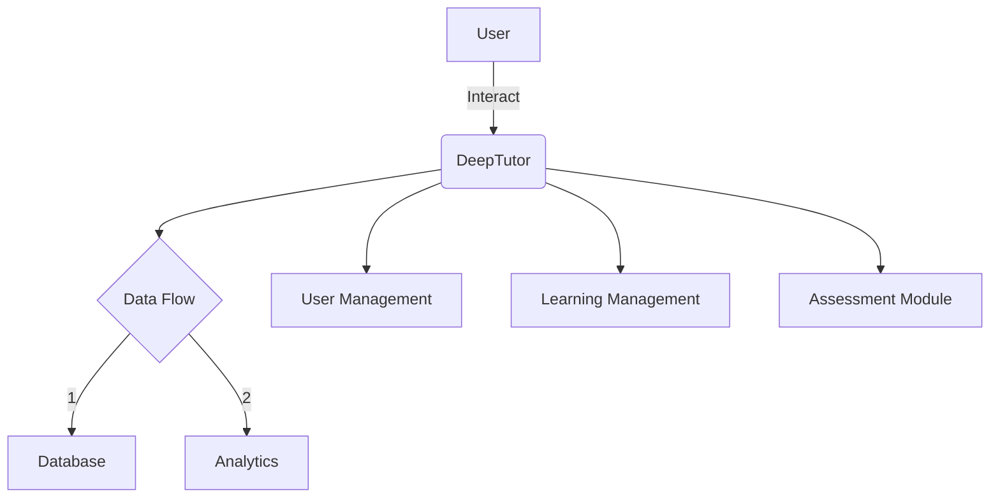
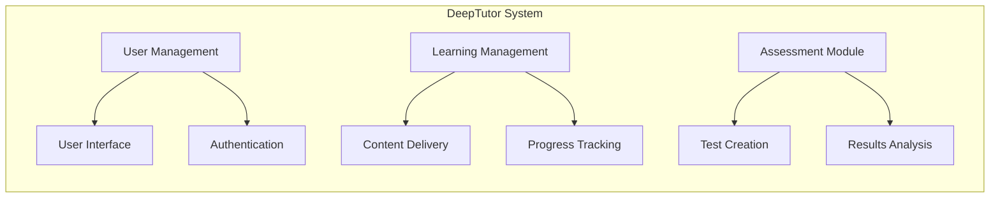

# DeepTutor Analysis (Bilingual)

## Executive Summary
This document provides a comprehensive analysis of the DeepTutor repository. It outlines the architecture, end-to-end flows, codebase structure, modules, modification guidance, risk assessments, reading order, and includes architecture diagrams in the Mermaid format.

### Tóm tắt điều hành
Tài liệu này cung cấp phân tích toàn diện về kho lưu trữ DeepTutor. Nó phác thảo kiến trúc, quy trình đầu cuối, cấu trúc mã nguồn, các mô-đun, hướng dẫn sửa đổi, đánh giá rủi ro, thứ tự đọc và bao gồm các biểu đồ kiến trúc dưới định dạng Mermaid.

## Architecture
The architecture of DeepTutor is designed to support scalable and efficient learning.

### Kiến Trúc
Kiến trúc của DeepTutor được thiết kế để hỗ trợ việc học tập có khả năng mở rộng và hiệu quả.

## End-to-End Flows
DeepTutor follows specific end-to-end flows for user interactions and data processing.

### Quy Trình Đầu Cuối
DeepTutor tuân theo các quy trình đầu cuối nhất định cho các tương tác của người dùng và xử lý dữ liệu.

## Codebase Structure
The codebase is organized into several key modules facilitating various functionalities.

### Cấu Trúc Mã Nguồn
Kho mã được tổ chức thành nhiều mô-đun chính hỗ trợ các chức năng khác nhau.

## Modules
Key modules include:
- User Management
- Learning Management
- Assessment Module

### Các Mô-đun
Các mô-đun chính bao gồm:
- Quản lý người dùng
- Quản lý học tập
- Mô-đun đánh giá

## Modification Guide
Steps to modify the DeepTutor:
1. Clone the repository.
2. Make the required changes.
3. Follow coding standards.
4. Submit a pull request.

### Hướng Dẫn Sửa Đổi
Các bước để chỉnh sửa DeepTutor:
1. Sao chép kho lưu trữ.
2. Thực hiện các thay đổi cần thiết.
3. Tuân thủ các tiêu chuẩn mã hóa.
4. Gửi yêu cầu kéo.

## Risk Assessment
Potential risks include performance bottlenecks and scalability issues.

### Đánh Giá Rủi Ro
Các rủi ro tiềm ẩn bao gồm tắc nghẽn hiệu suất và vấn đề khả năng mở rộng.

## Reading Order
Start with the executive summary, followed by architecture and flows.

### Thứ Tự Đọc
Bắt đầu với tóm tắt điều hành, tiếp theo là kiến trúc và quy trình.

## Architecture Diagrams

