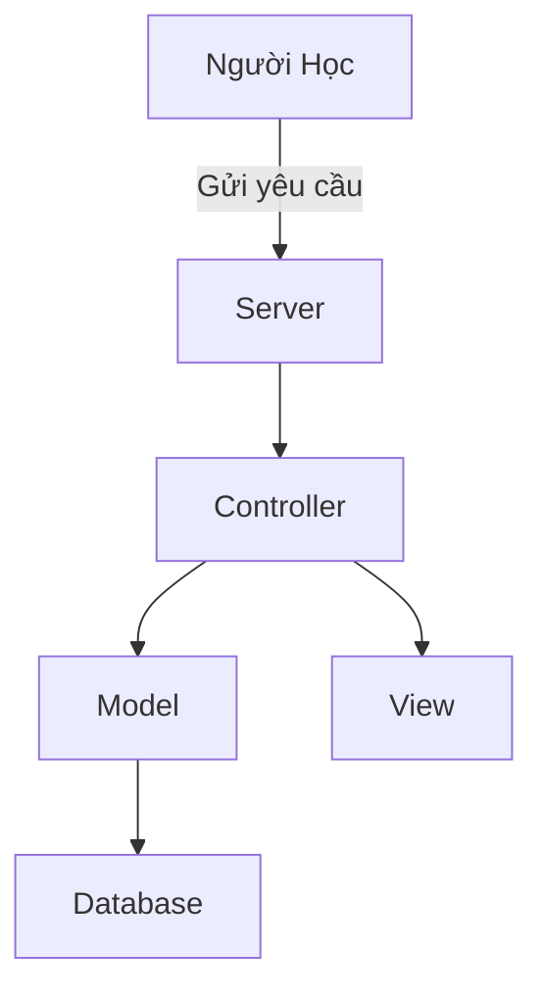

# Phân Tích Chi Tiết về DeepTutor

## Tóm tắt điều hành
DeepTutor là một hệ thống hỗ trợ học tập dựa trên trí tuệ nhân tạo, giúp người học cải thiện kỹ năng và hiểu biết thông qua các bài học tương tác và phản hồi tức thì.

## Chức Năng Của Repository
Repository này cung cấp mã nguồn cho DeepTutor, bao gồm các mô-đun học máy, giao diện người dùng và backend.

## Tính Năng Chính
- Học tương tác: Cung cấp bài học và phản hồi tức thì.
- Tùy biến: Hệ thống có thể tùy chỉnh theo nhu cầu học tập của người dùng.
- Phân tích tiến trình: Ghi lại và phân tích tiến trình học của người dùng.

## Kiến Trúc Cấp Cao
DeepTutor sử dụng mô hình kiến trúc MVC (Model-View-Controller), cho phép quản lý dữ liệu, giao diện và logic một cách tách biệt.

## Luồng End-to-End
1. Người học đăng nhập vào hệ thống.
2. Hệ thống cung cấp bài học dựa trên nhu cầu của người học.
3. Người học hoàn thành bài học và nhận phản hồi.
4. Hệ thống phân tích hành vi và tiến trình học của người học.

## Cấu Trúc Codebase
- **/models**: Mô hình dữ liệu.
- **/views**: Giao diện người dùng.
- **/controllers**: Logic xử lý.

## Điểm Nhập
Điểm nhập chính vào ứng dụng là file `app.py`, nơi khởi tạo và chạy server.

## Các Mô-đun Quan Trọng
- `ml_module.py`: Chứa logic học máy.
- `user_interface.py`: Quản lý giao diện dành cho người dùng.

## Hướng Dẫn Chỉnh Sửa Tệp
1. Xác định tệp cần chỉnh sửa.
2. Thực hiện các thay đổi cần thiết.
3. Đảm bảo kiểm tra sau khi thay đổi để xác minh hoạt động của ứng dụng.

## Tệp Rủi Ro
- Các tệp trong thư mục `controllers` có thể gây ra lỗi do logic sai lệch.

## Đọc Gợi Ý Thứ Tự
1. app.py
2. ml_module.py
3. user_interface.py

## Sơ Đồ Kiến Trúc (Mermaid)

## Các Mẫu và Nguyên Tắc Thiết Kế Chính
- Nguyên tắc phân tách trách nhiệm: Mỗi mô-đun đảm nhiệm một tác vụ cụ thể.
- Mẫu MVC: Phát triển ứng dụng một cách rõ ràng và có tổ chức.

## Kết Luận Cuối
DeepTutor là một nền tảng mạnh mẽ để hỗ trợ học tập, với kiến trúc rõ ràng và khả năng mở rộng dễ dàng. Người phát triển có thể dễ dàng hiểu và tham gia vào hệ thống để mở rộng các tính năng hoặc cải thiện hiệu suất.